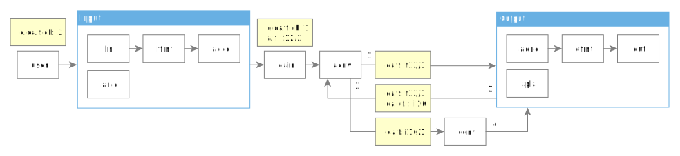

# phiola Architecture


## Android


## Track's Audio Conversion

Example of a track chain for audio conversion:

* User wants mono audio by specifying `channels=1`
* Input filter produces `float32/stereo`
* Output filter requires `int16` input



1. `aconv` prepares output audio format by taking input format and applying user settings (`conf.oaudio.channels=1`).
2. Output filter (`aenc` or `apla`) requests audio conversion (`oaudio.conv_format.format=int16`).
3. `aconv` applies the conversion format specified by output filter.  The resulting conversion will be `float32/stereo => int16/mono`.  Adds `conv` filter to the chain.
4. `conv` performs the conversion and supplies data to output filter.

Playback with filtering (single converter):

```
                   oa.f:
   a.f:     oa.f:  oa.cf:
    i24      i24    f64
    48k      48k
    ni       ni     i
dec -> aconv -> af -> adev.play

                   oa.cf:
                    i16
                    96k
          *  <------- *

            oa.f:
             i16
             96k
             i
          *  -> *
```

Playback with filtering (double converter):

```
   a.f:      oa.f:
    i24        f64
    48k
    ni         i
dec -> aconv-f -> af -> aconv -> adev.play

                          oa.cf:
                           i16
                           96k
            *  <------- *  <-- *

            oa.f:          oa.f:
             f64            i16
             48k            96k
             i
          *  -> * ->    *   -> *
```


## Seeking

Case 1.  Seek position is initially set (e.g. with --seek=TIME).

```C
	           fmt            dec        ui
	=========================================
	S=N,Q=1 -> (Q&&S!=''):
	           seek(S),Q=0 -> dec()
	           *           <- *
	           (!Q)        -> skip(S) -> S=''
```

`S` - seek position.
`Q` - seek request flag.

Case 2.  Seek position is set in 'ui' module by user's command while the currently active filter is 'ui' itself or any previous filter.
Key factor: 'ui' can't update seek position `S` while it's still in use by previous filters.
Note: 'dec' may check `Q` (which means a new seek request is received) to interrupt the current decoding process.

```C
	file      fmt             dec        ui       aout
	==============================================================
	                                   s=N,Q=1 -> stop()
	... <-> ...         <-> ...
	                        (Q)     -> *
	        (Q&&S!=''): <------------- S=s
	        seek(S),Q=0 --> dec()
	        *           <-- *
	        (!Q)        --> skip(S) -> S=''    -> clear(),write()
```

Case 3.  Seek position is set in 'ui' module by user's command while the currently active filter is 'aout' or previous filters.
Key factor: 'aout' discards all current data (due to `Q`) and requests new data immediately.

```C
	fmt            dec        ui         aout               core
	============================================================
	                          s=N,Q=1 -> stop()          -> *
	(Q&&S!=''): <------------ S=s     <- (Q)             <- *
	seek(S),Q=0 -> dec()
	               skip(S) -> S=''    -> clear(),write()
```

Case 4.  Seeking on .cue tracks.  These tracks have `abs_seek` value set.
Key factor: 'fmt' and 'dec' know nothing about `abs_seek`;
 'cuehook' module updates current position and seek position values.

```C
	track    fmt              dec        cuehook    ui
	====================================================
	S+=AS -> seek(S),POS=S -> dec()
	                          skip(S) -> POS-=AS -> S=''
	         *             <------------ S+=AS   <- S=N
	         ...
```

`POS` - current audio position.
`AS` - audio offset for the current .cue track (`abs_seek`).


## .ogg chained stream reading

```C
ogg.wr        opus-meta      opus.dec
=======================================
...
* detects new stream
RST=1 -hdr->  ?RST
              *hdr
          ->  *tag    -hdr-> ?RST
              RST=0    <-    *skip
          ->  *data   -tag-> *skip
                     -data-> *decode
```

`RST` flag is set when a new logical stream is detected; it signifies that the next 2 packets are opus-info and vorbis-tags.


## .ogg write

Case 1.  Add packets normally with known audio position of every packet.
Note: `GEN_OPUS_TAG` flag is for mkv->ogg copying.

```C
	mkv.in              ogg.out                      file.out
	==============================================================
	GEN_OPUS_TAG=1
	POS='',PKT=.     -> cache=PKT //e.g. Opus hdr
	POS=n,PKT=.      -> write(cache,end=0,flush)  -> *
	                    GEN_OPUS_TAG:
	                    write("...",end=0,flush)  -> *
	*                <- cache=PKT                 <- *
	POS=n+1,PKT=.    -> write(cache,end=POS)
	*                <- cache=PKT
	           ...
	POS=.,PKT=.      -> write(cache,end=POS)      -> *
	*                <- cache=PKT                 <- *
	           ...
	POS=.,PKT=.,DONE -> write(cache,end=POS)
	                    write(PKT,end=TOTAL,last) -> *
```

Case 2.  Input is OGG with only end-position value of each page.

```C
	ogg.in         ogg.out        file.out
	=================================================================
	END=0,FLUSH -> write()     -> * //e.g. Opus hdr
	END=0,FLUSH -> write()     -> * //e.g. Opus tags
	END=-1      -> write()
	       ...
	END=.,FLUSH -> write()     -> *
	DONE        -> write(last) -> *
```


## .ogg(Opus) Notes

Example of a 2-second .ogg(Opus) file map:

	page #0  end-pos:0      packets:1   flags:2  size:47
	page #1  end-pos:0      packets:1   flags:0  size:1039
	page #2  end-pos:48000  packets:25  flags:0  size:22399
	page #3  end-pos:96000  packets:25  flags:0  size:22180
	page #4  end-pos:96312  packets:1   flags:4  size:990

`312` is an Opus preskip samples (the N of samples decoder must skip from the first frame):

	ogg-read: page #2  end-pos:48000  packets:25
	opus-decode: decoded 1920 samples @0
	tui: samples: @0(0ms) +1608 [1608]
	opus-decode: decoded 1920 samples @1920
	tui: samples: @1608(33ms) +1920 [3528]

When copying, the last OGG page is written with granule-pos value `+1`.
Example of the output file's map after `phiola co -copy -u 1`:

	page #0  end-pos:0      packets:1   flags:2  size:47
	page #1  end-pos:0      packets:1   flags:0  size:1039
	page #2  end-pos:48000  packets:25  flags:0  size:22399
	page #3  end-pos:48001  packets:1   flags:4  size:911


## .aac Notes

For HE and HEv2 profiles phiola can obtain sample rate & channels number only after the decoder reports these values (libFDKAAC parses SBR/PS info block that is 'buried' deep within AAC frame).
Example:

	aac-adts-read: passing frame #0  samples:1024 @0  size:19  aot:2 rate:22050 chan:1
	aac-decode:    decoded 2048 samples @0  aot:5 rate:44100 chan:2 br:3273
	aac-adts-read: passing frame #1  samples:1024 @1024  size:22  aot:2 rate:22050 chan:1
	aac-decode:    decoded 2048 samples @2048  aot:29 rate:44100 chan:2 br:3789


## GUI Playlist Synchronization

```C
dir-read         queue                  Core       GUI                GTK
================================================================================
[Main Thread]
* (8 entries) -> * -> onchange('a') ->             *
                                        * timer <- * cmd=ADD
                      onchange('a') ->             * cmd=UPD
                      ...           ->             .
...
                                        * ->       * view.length() -> *
[GUI Thread]
                 . ref()                        <- * display()     <- *
                                                                   <- ...
```


## Build

Global call+include+targets map:

```sh
	xbuild-debian....sh ARGS=...
		podman
			! /netmill/3pt/Makefile
				+ config.mk
					+ /ffbase/conf.mk
				! openssl/Makefile
					> libssl.so
			! /ffpack/Makefile
				+ config.mk
					+ /ffbase/conf.mk
				! zstd/Makefile
					> libzstd.so
			! alib3/Makefile
				> lib...-phi.so
					! alib3/.../Makefile
						+ alib3/config.mk
			! Makefile $ARGS
				+ /ffbase/conf.mk
				> ....so
					+ src/.../Makefile
				app
					> phiola-2
				package
					> phiola...tar.zst
	xbuild-android.sh ARGS=...
		podman
			! /netmill/3pt/Makefile
				+ config.mk
					+ /ffbase/conf.mk
					+ android/andk.mk
				! openssl/Makefile
					> libssl.so
			! /ffpack/Makefile
				+ config.mk
					+ /ffbase/conf.mk
					+ andk.mk
				! zstd/Makefile
					> libzstd.so
			! alib3/Makefile
				> lib...-phi.so
					! alib3/.../Makefile
						+ alib3/config.mk
							+ android/andk.mk
			! android/Makefile $ARGS
				+ /ffbase/conf.mk
				+ android/andk.mk
				libs
					> ....so
						+ src/.../Makefile
					*.so -> lib*.so
				apk
					gradle
```


## Benchmarks

### FDK-AAC

Test file: 44.1KHz/stereo/06:16

	phiola co i.flac -aac_q 5 -o q5.m4a -perf
	phiola co i.flac -aac_q 192 -o q192.m4a -perf
	phiola co q5.m4a -perf -o @stdout.wav >/dev/null
	phiola co q192.m4a -perf -o @stdout.wav >/dev/null

amd64

| Ver | Enc(q192) | Enc(q5)  | Dec(q5)  | Dec(q5) NL | Dec(q192) NL |
| --- | --- | --- | --- | --- | --- |
| 203 | 3.055     | 3.251    | 1.006    | 0.942      | 0.865        |
| 201 | 3.045     | 3.475    |          | 0.952      | 0.878        |
| 200 |           |          |          | 0.943      | 0.875        |
| 016 | 4.087     | 4.772    | 0.848(!) | 0.739      |              |
| 015 | 4.177     | 4.858    | 0.853    |            |              |
| 014 | 4.062     | 4.707    | 0.846    | 0.712(!)   |              |
| 013 | 4.049     | 4.713    |          | 0.718      |              |
| ffmpeg* | 5.726 |          |          | 0.461      | 0.447        |

* Encoder settings: `AACENC_AFTERBURNER=1`, `AACENC_SIGNALING_MODE=1`, `AACENC_TRANSMUX=TT_MP4_RAW`
* NL means "no limiter", i.e. `AAC_PCM_LIMITER_ENABLE=0`
* !!! **v203 decoder is `18%` slower than v016**
* v203 decoder is `27%` slower than v016 with "limiter" disabled and `200%` slower than ffmpeg
* v014 introduced "limiter" feature that slows down decoder by `18%`
* The ffmpeg results are for reference

arm64

| Ver | Enc(q192) | Enc(q5)  | Dec(q192) | Dec(q5)  |
| --- | --- | --- | --- | --- |
| 203 | 5.503     | 5.863    | 1.779     | 1.823    |
| 016 | 7.434     | 8.647    | 1.935     | 2.066    |
